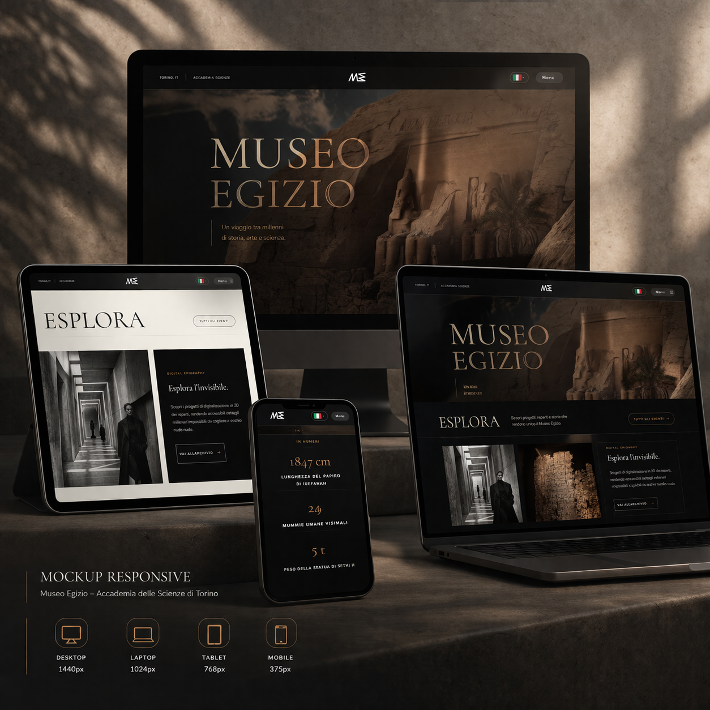

# Museo Egizio — demo front-end

Interfaccia web **dimostrativa** ispirata al [Museo Egizio di Torino](https://www.museoegizio.it/): home immersiva, pagine istituzionali, biglietteria e shop in **anteprima non transazionale**, internazionalizzazione multi-lingua e integrazioni opzionali (Google Places).  
**Non è il sito ufficiale del museo** né è affiliato alla Fondazione Museo delle Antichità Egizie di Torino.

---

## Anteprima



---

## Funzionalità principali

- **Home** con hero video, scroll fluido (Lenis), animazioni GSAP / ScrollTrigger, cursore custom, sezioni editoriali e griglia “Pianifica” con stato museo in tempo reale (orari locali Italia + stima affluenza).
- **Pagine** `/visita`, `/ricerca`, `/notizie`, `/il-museo` con layout condiviso (`MuseumPageLayout`), reveal on scroll.
- **Biglietti** (`/biglietti`) e **Shop** (`/shop`) con flussi UI in anteprima; carrello e checkout simulati.
- **i18n**: Italiano, English, Français, Español, 日本語, 中文, Deutsch — testi in `src/locales/`.
- **Opzionale**: sincronizzazione stato apertura con **Google Places API (New)** tramite variabili d’ambiente (vedi sotto).

---

## Stack tecnologico

| Area | Tecnologie |
|------|------------|
| **Runtime UI** | [React 19](https://react.dev/), [React Router 7](https://reactrouter.com/) |
| **Build** | [Vite 8](https://vite.dev/) + [@vitejs/plugin-react](https://github.com/vitejs/vite-plugin-react) |
| **Styling** | [Tailwind CSS 3](https://tailwindcss.com/), PostCSS, Autoprefixer |
| **Animazione** | [GSAP 3](https://gsap.com/) + ScrollTrigger |
| **Scroll** | [Lenis](https://github.com/darkroomengineering/lenis) (smooth scroll sulla home) |
| **Font** | [@fontsource](https://fontsource.org/): Cormorant, DM Sans, Noto Sans Egyptian Hieroglyphs |
| **Icone bandiere** | [country-flag-icons](https://github.com/lipis/flag-icons) (language switcher) |
| **Lint** | ESLint 9 (`eslint`, `@eslint/js`, `eslint-plugin-react-hooks`, `eslint-plugin-react-refresh`) |

**Palette (Tailwind)** — definita in `tailwind.config.js`:

- `papiro` `#F9F9F6`, `inchiostro` `#1A1A1A`, `oro` `#C28F59`
- Famiglie: `font-gambetta` (Cormorant), `font-satoshi` (DM Sans), `font-hieroglyph`

---

## Struttura del progetto

```
frontend-museo/
├── public/                 # Asset statici (video hero, immagini, ecc.)
├── src/
│   ├── App.jsx             # Router e provider globali
│   ├── main.jsx            # Entry: font, CSS, mount React
│   ├── index.css           # Base + Tailwind
│   ├── routeHistory.js     # Storia navigazione (quick mount home)
│   ├── components/         # UI riutilizzabile
│   │   ├── MuseumPageLayout.jsx   # Shell pagine interne (header, menu, footer credit)
│   │   ├── MenuOverlay.jsx
│   │   ├── TicketsShopOverlay.jsx
│   │   ├── MuseumLiveStatusCard.jsx
│   │   ├── Cursor.jsx, MagneticBtn.jsx, MarqueeBtn.jsx
│   │   └── …
│   ├── pages/              # Una route per file
│   │   ├── HomePage.jsx
│   │   ├── VisitaPage.jsx, RicercaPage.jsx, NotiziePage.jsx, IlMuseoPage.jsx
│   │   ├── AcquistaBigliettiPage.jsx, ShopPage.jsx
│   ├── context/            # Language, Cart, Audio
│   ├── locales/
│   │   ├── messages.js     # Nav, overlay shop, chiavi condivise
│   │   ├── pagesContent.js
│   │   └── content/
│   │       ├── siteLocales.js   # Copy pagine / home / booking
│   │       └── shopLocales.js   # Copy shop / carrello
│   ├── lib/                # Logica dominio lato client
│   │   ├── museumHours.js       # Orari Europe/Rome, aperto/chiuso
│   │   ├── museumCrowdEstimate.js
│   │   └── googlePlacesOpening.js
│   ├── data/               # shopProducts, museoCopy, hieroglyphs
│   └── utils/
├── index.html
├── vite.config.js
├── tailwind.config.js
├── postcss.config.js
├── eslint.config.js
├── .env.example
└── package.json
```

---

## Requisiti

- **Node.js** 20+ (consigliato LTS)
- **npm** (o `pnpm` / `yarn` con adattamento dei comandi)

---

## Installazione e script

```bash
cd frontend-museo
npm install
npm run dev      # http://localhost:5173 (dev server Vite)
npm run build    # output in dist/
npm run preview  # anteprima build di produzione
npm run lint     # ESLint
```

---

## Variabili d’ambiente

Copia `.env.example` in `.env` nella root di `frontend-museo` e compila solo se ti serve lo stato da **Google Places**:

| Variabile | Descrizione |
|-----------|-------------|
| `VITE_GOOGLE_PLACES_API_KEY` | Chiave con *Places API (New)* abilitata su Google Cloud |
| `VITE_GOOGLE_PLACE_ID` | Place ID del punto d’interesse (museo) |

La chiave è inclusa nel bundle client: in produzione reale conviene un **proxy server-side** per non esporre la key.

---

## Deploy

Produzione: sito statico dopo `npm run build` (cartella `dist/`).  
Compatibile con **Vercel**, **Netlify**, **GitHub Pages** (con `base` corretto se il repo non è in root del dominio), Cloudflare Pages, ecc.

---

## Crediti

Design / sviluppo front-end: [Michel Branche](https://devmichelbranche.vercel.app/)

---

## Licenza

Il codice di questo repository è messo a disposizione per **portfolio e dimostrazione**.  
Testi, marchi e riferimenti al Museo Egizio restano di competenza dei rispettivi titolari; le immagini e i contenuti istituzionali vanno verificati prima di un uso pubblico non dimostrativo.
